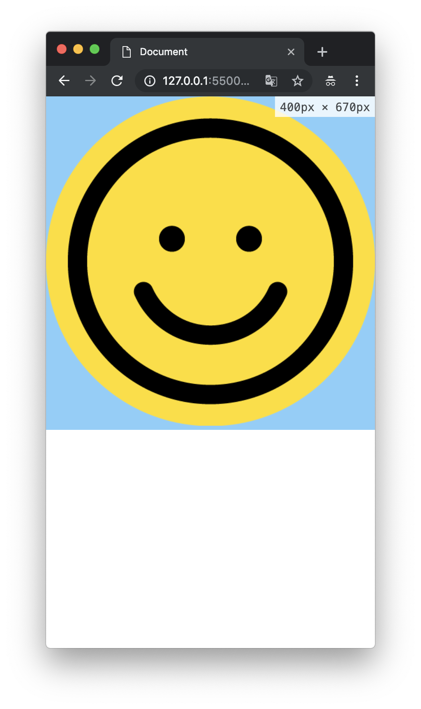
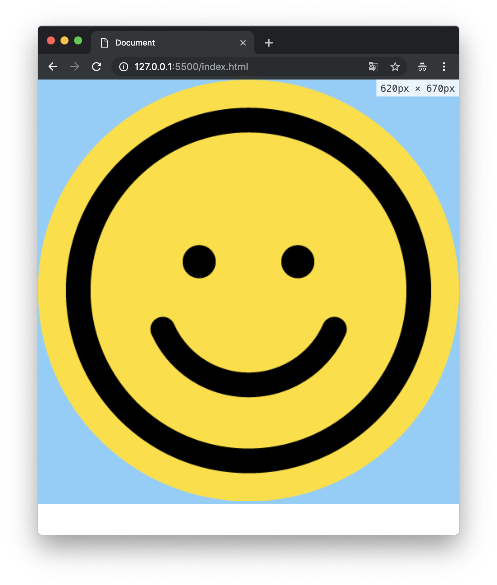
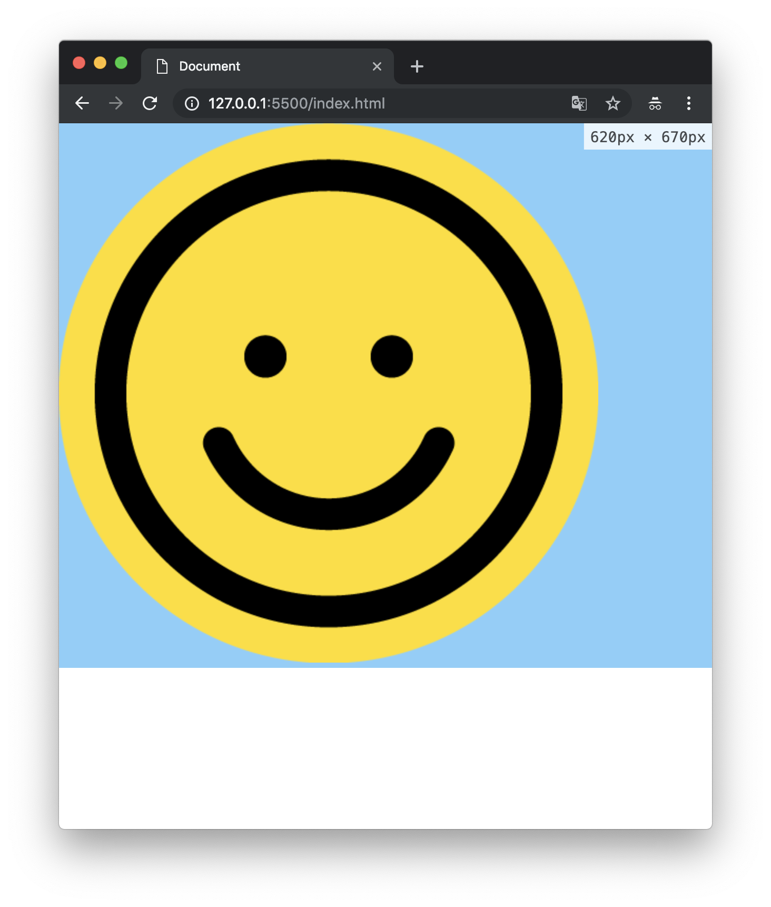

# `img` 요소에 `width: 100%`와 `max-width: 100%`를 설정하는 것의 차이점

기본적으로 `img` 요소에 `width`를 명시하지 않을 경우, 해당 이미지는 컨테이너 요소의 크기에 상관없이 자신의 원본 크기를 유지한다.

`img` 요소에 `width: 100%`를 선언한 경우, 이미지의 크기는 자신의 원본 크기와 상관없이 컨테이너 요소에 꽉찬 형태로 보여진다.

그러나 `max-width: 100%`를 선언한 경우, `img` 요소를 감싼 컨테이너 요소의 너비가 원본 이미지의 너비보다 작거나 같은 상황에서는 꽉찬 형태로 보여지지만, 그 이상부터는 `img` 요소의 너비는 더 늘어나지 않고 자신의 원본 크기를 유지한 형태로 보여진다.

## 예시

다음과 같이 `img` 요소를 감싼 컨테이너 요소를 만든 후, 브라우저 창의 크기를 조절해가며 두 경우를 비교해보자. 여기서 사용한 이미지의 원본 크기는 '512 x 512'이다.

### 1. `width: 100%`를 지정한 경우

이미지의 원본 크기와는 상관없이, 이미지는 컨테이너 요소에 꽉 들어찬 형태로 보여진다.

```html
<!DOCTYPE html>
<html lang="en">
<head>
  <meta charset="UTF-8">
  <meta name="viewport" content="width=device-width, initial-scale=1.0">
  <meta http-equiv="X-UA-Compatible" content="ie=edge">
  <title>Document</title>
  <style>
    body {
      margin: 0;
      padding: 0;
    }

    .container {
      background-color: lightskyblue;
    }

    .smile {
      width: 100%;
    }
  </style>
</head>
<body>
  <div class="container">
    
  </div>
</body>
</html>
```

#### 1.1 컨테이너 요소의 너비가 이미지 원본 너비인 512px보다 작은 경우



#### 1.2 컨테이너 요소의 너비가 이미지 원본 너비인 512px보다 큰 경우



### 2. `max-width: 100%`를 지정한 경우

컨테이너 요소의 너비가 이미지의 원본 너비인 512px보다 작을 경우에는 꽉 들어찬 형태로 보여지지만, 그 이상일 경우 이미지는 더 늘어나지 않고 자신의 원본 너비인 512px을 유지한다.

```html
<!DOCTYPE html>
<html lang="en">
<head>
  <meta charset="UTF-8">
  <meta name="viewport" content="width=device-width, initial-scale=1.0">
  <meta http-equiv="X-UA-Compatible" content="ie=edge">
  <title>Document</title>
  <style>
    body {
      margin: 0;
      padding: 0;
    }

    .container {
      background-color: lightskyblue;
    }

    .smile {
      max-width: 100%;
    }
  </style>
</head>
<body>
  <div class="container">
    
  </div>
</body>
</html>
```

#### 2.1 컨테이너 요소의 너비가 이미지 원본 너비인 512px보다 작은 경우


#### 2.2 컨테이너 요소의 너비가 이미지 원본 너비인 512px보다 큰 경우


