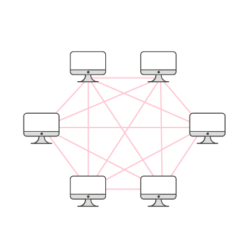
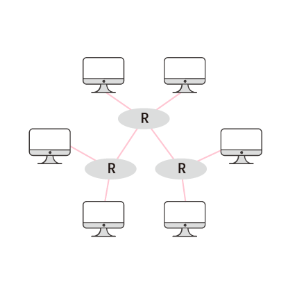

# 라우터

## 라우터

인터넷은 한 장치에서 다른 장치로 정보를 보낼 수 있게 한다. 그리고 인터넷에서 데이터를 쉽게 전송하도록 돕기 위해서 라우터가 사용된다. 라우터는 인터넷의 구성 요소로, 데이터를 다양한 네트워크로 보내준다. 라우터는 보낸 데이터가 올바른 목적지에 잘 도착할 수 있도록 보장하기 위해서 특정 명령어 집합을 따른다.

## 라우팅 모델

인터넷에서, 인터넷에 연결된 모든 장치들은 다른 인터넷에 연결된 장치들과 통신할 수 있어야 한다. 이러한 네트워크를 구성하기 위한 방법 중 하나는 <그림 1>과 같이 하는 것이다. 이 네트워크상에 있는 모든 컴퓨터는 인터넷에 연결된 다른 모든 컴퓨터와 물리적으로 연결되어 있다.

한 컴퓨터에서 다른 컴퓨터로 정보를 보낼 때, 정보를 곧장 목적지로 보내기 때문에, 이 모델을 이용하면 전송 속도가 빠르다. 그러나 이러한 모델은 비현실적으로 많은 물리적 연결이 필요할 것이다. 위 그림 에서 인터넷에 6개의 컴퓨터만 있는데도 연결망이 복잡해 보인다. 안터넷에 연결된 장치가 수백만, 수십억 개라면 서로 다른 모든 컴퓨터들을 연결한다는 것은 불가능에 가깝다.

대신에, 인터넷은 라우터를 쓴다. 라우터는 인터넷상의 장치들 사이에서 중재자 역할을 한다. 모든 컴퓨터는 아래 그림처럼 어떤 라우터 하나와 연결되어 있고, 각 라우터는 다른 라우터들과 연결되어 있다. 그렇기 때문에, 컴퓨터는 하나 이상의 라우터를 거쳐 데이터를 인터넷상의 다른 컴퓨터로 보낼 수 있다.

이러한 방법으로 인터넷상의 모든 컴퓨터들은 다른 모든 컴퓨터들과 통신할 수 있다. 이때, 전송되는 데이터들은 '패킷'이라는 단위로 라우터를 통해 인터넷을 거쳐 보내진다. 각 라우터는 목적지 컴퓨터와 연결되어 있는 라우터 중에 목적지에 가까운 라우터로 패킷을 보낸다.

## 라우팅 테이블

라우터는 각 데이터 패킷이 목적지 IP 주소에 따라 어디로 보내져야 하는지를 알 수 있도록 만들어져 있다. 이 정보들은 대체로 라우팅 테이블에 저장되어 있다. 라우터는 IP 주소의 앞 숫자들을 보고, 패킷을 어느 방향으로 보내야 할지를 판단한다.

하지만, 라우터는 데이터 패킷이 목적지까지 도달하는 데 필요한 정확한 경로 정보를 갖고 있지 않아도 된다. 라우터는 그저 패킷을 목적지까지 한 단계 더 가까이 보내주고 나머지 일은 다음 라우터에게 맡긴다. 또한 일반적으로 데이터가 인터넷의 한 지점에서 다른 지점으로 가기 위한 경로는 하나가 아니다. 라우터는 같은 목적지의 데이터 패킷들을 서로 다른 경로로 보낸다.
